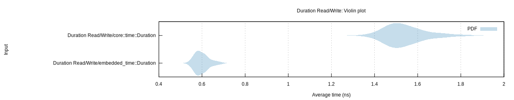

# embedded-time &emsp; ![CI] [![crates.io]](https://crates.io/crates/embedded-time) [![docs.rs]](https://docs.rs/embedded-time)

[CI]: https://github.com/FluenTech/embedded-time/workflows/CI/badge.svg
[crates.io]: https://img.shields.io/crates/v/embedded-time.svg
[docs.rs]: https://docs.rs/embedded-time/badge.svg

`embedded-time` provides a comprehensive library implementing _duration_, _rate_, _instant_, and software _timer_ types as well as a _clock_ trait for abstracting over hardware timers/clocks.

## Duration Types

| Units        | Extension    |
| :----------- | :----------- |
| Hours        | hours        |
| Minutes      | minutes      |
| Seconds      | seconds      |
| Milliseconds | milliseconds |
| Microseconds | microseconds |
| Nanoseconds  | nanoseconds  |

- Conversion from `Rate` types
    ```rust
    Microseconds::<u32>::try_from_rate(Kilohertz(2_u32)) -> Ok(Microseconds(500_u32))
    ```

- Conversion to/from `Generic` `Duration` type

    ```rust
    Seconds(2_u64).try_into_generic(Fraction::new(1, 2_000)) -> Ok(Generic::new(4_000_u32, Fraction::new(1, 2_000))))
    Seconds::<u64>::try_from(Generic::new(2_000_u32, Fraction::new(1, 1_000))) -> Ok(Seconds(2_u64))
    ```

### `core` Compatibility

- Conversion to/from `core::time::Duration`

### Benchmark Comparisons to `core` duration type

#### Construct and Read Milliseconds

```rust
let duration = Milliseconds::<u64>(ms); // 8 bytes
let count = duration.count();
```

_(the size of `embedded-time` duration types is only the size of the inner type)_

```rust
let core_duration = Duration::from_millis(ms); // 12 bytes
let count = core_duration.as_millis();
```

_(the size of `core` duration type is 12 B)_



## Rate Types

| Units             | Extension |
| :---------------- | :-------- |
| Megahertz         | MHz       |
| Kilohertz         | kHz       |
| Hertz             | Hz        |
|                   |           |
| MebibytePerSecond | MiBps     |
| MegabytePerSecond | MBps      |
| KibibytePerSecond | KiBps     |
| KiloBytePerSecond | KBps      |
| BytePerSecond     | Bps       |
|                   |           |
| MebibitPerSecond  | Mibps     |
| MegabitPerSecond  | Mbps      |
| KibibitPerSecond  | Kibps     |
| KilobitPerSecond  | kbps      |
| BitPerSecond      | bps       |
|                   |           |
| Mebibaud          | MiBd      |
| Megabaud          | MBd       |
| Kibibaud          | KiBd      |
| Kilobaud          | kBd       |
| Baud              | Bd        |

- Conversion from `Duration` types

    ```rust
    Kilohertz::<u32>::try_from_duration(Microseconds(2_u32)) -> Ok(Kilohertz(500_u32))
    ```

- Conversion to/from `Generic` `Rate` type

    ```rust
    Hertz(2_u64).try_into_generic(Fraction::new(1,2_000)) -> Ok(Generic::new(4_000_u32, Fraction::new(1,2_000))))
    Hertz::<u64>::try_from(Generic::new(2_000_u32, Fraction::new(1,1_000))) -> Ok(Hertz(2_u64))
    ```

## Hardware Abstraction

- `Clock` trait allowing abstraction of hardware timers/clocks for timekeeping.

## Timers

- Software timers spawned from a `Clock` impl object.
- One-shot or periodic/continuous
- Blocking delay
- Poll for expiration
- Read elapsed/remaining duration

## Reliability and Usability
- Extensive tests
- Thorough documentation with examples
- Example for the nRF52_DK board


## License
This project is licensed under either of
- [Apache License, Version 2.0](https://github.com/time-rs/time/blob/master/LICENSE-Apache)
- [MIT license](https://github.com/time-rs/time/blob/master/LICENSE-MIT)

at your option.

Unless you explicitly state otherwise, any contribution intentionally submitted for inclusion in `embedded-time` by you, as defined in the Apache-2.0 license, shall be dual licensed as above, without any additional terms or conditions.
